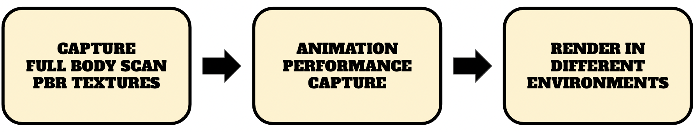
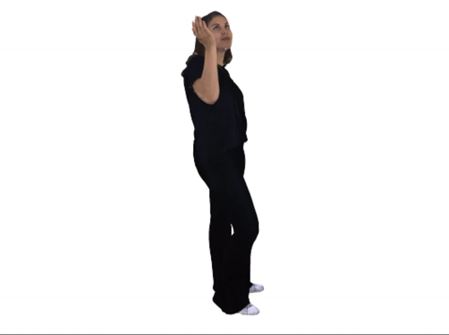
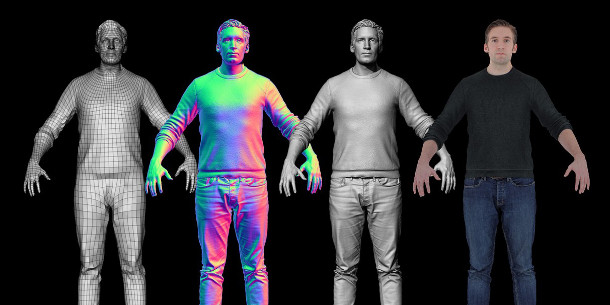
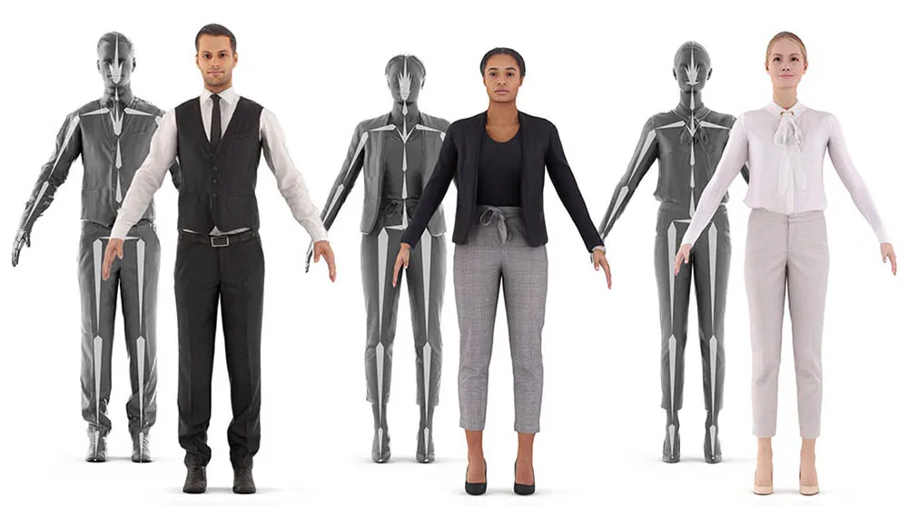
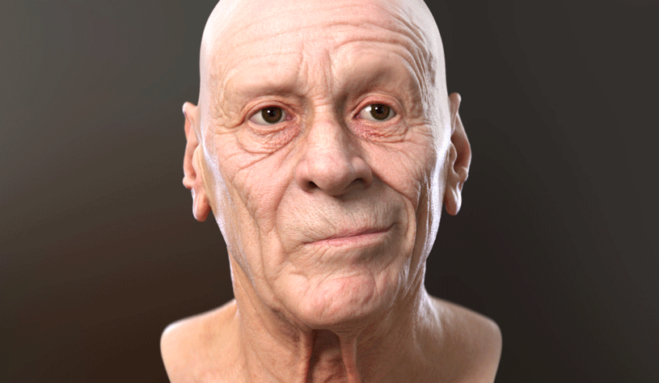
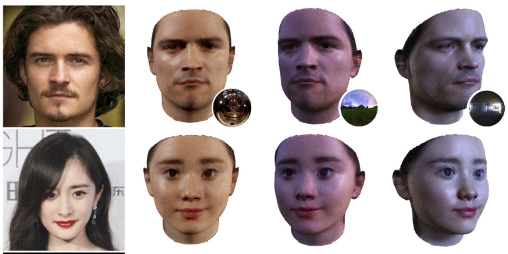
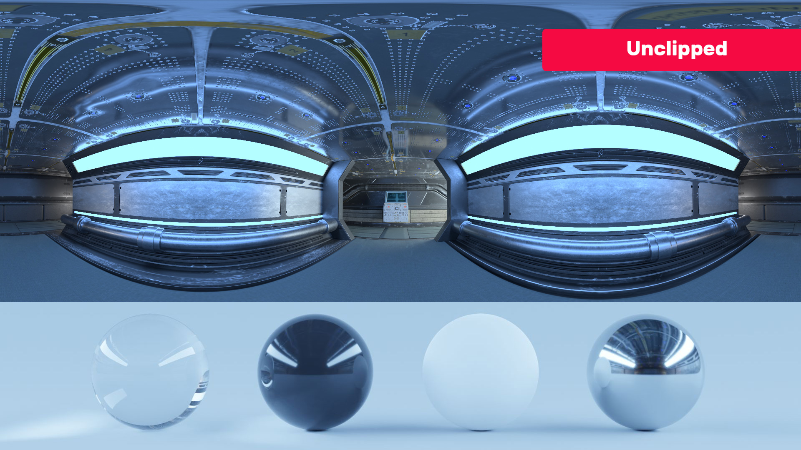

[[ABOUT]](#about) - [[OVERVIEW]](#overview) - [[ARCHITECTURE]](#volumetric-performance-capture) - [[PROGRESS]](#progress) - [[REFERENCES]](#references) - [[3D Volumetric Video Capture]](/vol_vid_cap/) - [[OTHER PROBLEMS]](/other_problems/)

# About

We have all grown up watching our superheroes come to life in the Marvel cinematic universe. Don’t you think it is time to wear a suit and join them? With the rise of the metaverse and the reality of the virtual worlds, we could realize our dreams of being vigilantes of the virtual universe. Our volumetric performance capture pipeline aims at easing the entire capture pipeline enabling everyone to live their dreams. Unlike traditional capture systems which range from high-end light stage-based capture to multi-DSLR camera setup, we target to create our relightable virtual replicas using single iPhone-based captures. We utilize 3D deep learning technology to aid our volumetric performance capture and rendering pipeline. Our virtual counterparts are captured as PBR BRDF-based texture components enabling them to be rendered in different environments from your 3D scanned home to the depths of Mordor in LOTR. They would be compatible with traditional software stacks like Unity3D, Unreal Engine or Blender.
Further, the models would be animated using markerless motion capture (mocap) technology. Our pipeline on a high level could be broken down into three stages (a) Full body capture (b) Animation Performance Capture (c) Relightable Environment Renders. Our solutions unlock the creativity in the hands of everyone to produce Hollywood-style animation using just a mobile phone.

# Overview

As mentioned in the previous stages there are three stages. The first stage involves full body capture where we scan a stationary person preferably in an 'A' pose or a 'T' pose. This capture acts as a canonical representation from which we are able to animate all other poses. The captured model is decomposed into their component diffuse, specular albedos and microscopic surface normals. The next stage involves learning the weights which are used to deform the canonical pose with respect to the target pose. It involves extracting the performance animation. The poses extracted are used to animate the canonical representation to create our target performance. Finally, we place our relightable models in the target environment. The target 3D environments are also generated by static scanning or reusing already created 3D environments shared by users.

# Volumetric Performance Capture
Lets dive a littel deep into the individual stages and understand the process in detail. 
## Full Body Capture

Scanning Process           |  Full body scan
:-------------------------:|:-------------------------:
 | 

For a full body, a scan involves a person standing in an 'A' pose while another person goes around the person capturing the person using LiDAR-based iPhone scans. Using the RGB image along with the depth information we use a hybrid intrinsic-extrinsic representation (namely DMTet) and a differentiable renderer (namely Nvdiffrast) to capture the model geometry and textures (Diffusion and specular albedos and surface normals). Unlike the whole body, the deformations on facial expressions are complex. To enable this we do a high-resolution canonical pose for the face separately.

## Performance Animation Capture
Fullbody animation rig     |  Face performace capture
:-------------------------:|:-------------------------:
     | 

Having captured the canonical mesh representation, the next step is to capture the actual performance. In this stage, we utilize state-of-the-art pose estimation algorithms to capture the 3D pose of the performance (namely OpenPose along with the depth information). With the target performance and the estimated pose, we learn the blending weights for the different poses by minimising the reconstruction error on the rendered images. Here too we run a separate stage to capture the facial performance and learn the blending weights anchored on the facial key points. With the help of the blending weights and the estimated pose, we should be able to build the rig for our replica models enabling them to be animated for any performance.

## Religtable Environment Renders
Faces in different environment     |  HDRI Environment map
:-------------------------:|:-------------------------:
  | 

The final stage involves rendering the performance in the specified environment. For this stage, we create 3D rigid body models of the world. We then extract an HDRI environment map of the scanned 3D environment. Using this environment map, we place our animated 3D objects in the environment and render them to match the encoded 3D world. With this setup in place, we would be able to render our performance in a photorealistic quality under varying environments.

# References
- [Deep Marching Tetrahedra: a Hybrid Representation for High-Resolution 3D Shape Synthesis ](https://nv-tlabs.github.io/DMTet/assets/dmtet.pdf)
- [Extracting Triangular 3D Models, Materials, and Lighting From Images](https://github.com/NVlabs/nvdiffrec)
- [Nvdiffrast](https://nvlabs.github.io/nvdiffrast/)
- [Environment Mapping](https://cseweb.ucsd.edu/classes/wi18/cse167-a/lec13.pdf)
- [Marching Tetrahedra](https://gist.github.com/d3x0r/5633f0548f4d7b283f8bab19e022acad)
- [DefTet: Learning Deformable Tetrahedral Meshes for 3D Reconstruction](https://arxiv.org/pdf/2011.01437.pdf)

<!-- 
Things to do:
- Ability to add dress and other accessories
- Add code and its link
- Add implementation plan
- Add reference implementation for face base relighting

Create 3D environments where you could transfer models

Creating 3D animated movies
Creating tikTok captures

Narrative: How would you like to star in a Marvel movie? Create a virtual character which you could animate
Three stage process: Capturing a avatar (or a better word), Capturing animation (Learning animation weights), Rendering it in different environments
The different stages:

Technology used:

Videos and photos are used to capture our happy and memorable moments we shared with our friends and family. It takes us back to the place and time when the event happened, helping us reminiscence the moment. Instead, how would it be if we could capture these fleeting moments in 3D? Store and share them with your friends and family like you share photos and videos? Invite them to that moment so that we all could relive it? We are building a system to recreate an immersive experience to bring your memories to life in VR. Wanna ride along mail me @ nitthilan@gmail.com -->
