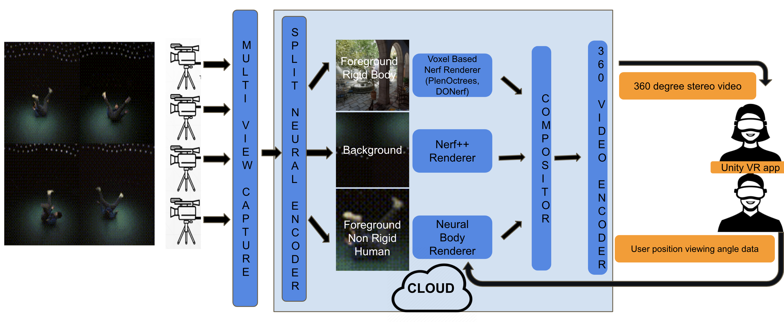

[About](#about) - [3D Volumetric Video System](#Deep-Neural-Radiance-Field-based-3D-Volumetric-Video-Capture-Rendering-and-Streaming) - [Drawbacks](#drawbacks) - [Problems](#problems-working-on) - [References](#references) - [Other Problems](/other_problems/)

##### About

Videos and photos are used to capture our happy and memorable moments we shared with our friends and family. It takes us back to the place and time when the event happened, helping us reminiscence the moment. Instead, how would it be if we could capture these fleeting moments in 3D? Store and share them with your friends and family like you share photos and videos? Invite them to that moment so that we all could relive it? We are building a system to recreate an immersive experience to bring your memories to life in VR. 

    

        <video src="https://user-images.githubusercontent.com/4926564/140678640-dd953bc5-185f-4f3a-8a56-6ce225625334.mov" autoplay loop controls="controls" style="width: 500px;"> </video> 
    

    

        <video src="https://user-images.githubusercontent.com/4926564/140678863-6f5c790f-f705-44fa-a1e0-47f311ddbe13.mp4" controls="controls" style="width: 500px;" autoplay loop>
		</video>
    

To give a overview of our solution, a user scans the 3D environment he wants to store, as a video capturing it from different viewing angles. He can use multiple cameras to capture more information about the environment like actions. We use artificial intelligence to reconstruct and encode the 3D environment using the different videos captured by the user. Unlike other methods which use laser or depth sensors to estimate point clouds, we just use the scanned RGB monocular videos to reconstruct the environment. Finally, this captured 3D environment is viewed using a VR headset in a 360-degree stereoscopic panorama. A stereoscopic photo is a pair of images, taken simultaneously with two lenses placed like our eyes, about 65 mm apart and looking in the same direction. When presented to the two eyes by a stereoscope, these images give most people the impression of seeing a 3D space. A stereoscopic panorama is a pair of 360-degree images, which when viewed with synchronized pano viewers (like a VR headset) presents a stereo pair. Further, as the user moves around in the environment, we generate the corresponding stereo pair based on the user position to give the user an immersive 3D experience. 

##### Deep Neural Radiance Field-based 3D Volumetric Video Capture, Rendering, and Streaming

Let's deep dive into the details of our solution. To provide a user with an immersive experience, the whole media pipeline from capture, storage, rendering, and streaming should be capable of handling 3D volumetric video data. Volumetric video capture technology is a technique that digitizes a three-dimensional space (i.e., the volume of space), object, or environment. The captured object can be digitized and transferred to the web, mobile, or virtual worlds and viewed in 3D. It does not have a set viewpoint, so the end-user can watch and interact with it from all angles, enhancing their experience and heightening their sense of immersion and engagement. The difference between 360-degree video and volumetric video is the depth provided with volume. In a 360-degree video, users can only view the action from a single, constant depth. With volumetric video, the end-user can play director and control how far in or out they want to explore the scene.

First, to capture 3D volumetric data, we would require a multi-camera system, which captures the action from different views. After capturing the data as a set of videos we process the videos such that we break down the scene into a less important background region, a center stage foreground area where the actual action happens. This helps in encoding the background with less detail and the foreground with higher precision. Further, to enhance the quality, we separate the objects in the foreground region into rigid and non-rigid human bodies. In effect, we split the scene into three prominent regions (a) Foreground Rigid Bodies (b) Foreground Non-Rigid (Human) Bodies (c) Background Region. We process them separately as three different pipelines. Unlike, other solutions which encode objects as meshes and textures, we encode each region using a deep neural radiance field-based solution. Next, to provide an immersive visualization, the three regions are rendered separately into a stereo 360-degree panoramic image for each time instant and stream it to a Unity VR app running on a VR headset. Thus we breakdown our system into the following components:

###### (a) Multi-view capture system

We design a capture system that ranges from 1 to N monocular RGB cameras. This could be as simple as one or more mobile cameras capturing a performance or scene from different angles. Since our setup is simple it enables anyone to create content that could be immersively consumed. The capture is timestamped so that multiple captures can be correlated for a particular time instance across different cameras. These different video streams are then uploaded to a cloud server.

###### (b) Split neural encoder, renderer and compositor

The next stage involves splitting the data into foreground and background, rigid and non-rigid (human) bodies. Each of these components is then encoded separately into a deep neural network. Background region is encoded using Nerf++ based network. The foreground requires optimized rendering (or inference) and many solution options are to be investigated. Some of the options are KiloNerf, PlenOctrees. Finally, the non-rigid body is encoded using Neural body-based network solutions. The scene is composited by rendering the individual neural networks encoded for the three separate regions based on the position and viewing angle feedback from the user. This composited stereo 360-degree panorama image is then passed on to the next stage to be compressed and streamed

###### (c) 360 Stereo video encoder 

The final stage, encodes the composited stereo image and compresses it into a video stream (H264, MPEG, MJPEG) and streamed to the VR headset. A Unity-based VR app displays the compressed stream on the skybox shader to provide an immersive visualization of the captured sequence to the end-user

##### Current status

- Individual modules are available for each module
- In the process of creating an MVP to demo the end-to-end solution
- Anyone interested in the following problems can reach me at nitthilan@gmail.com

##### Drawbacks

- The encoding (or storage) is time-consuming since it depends on the training time which is at present in the order of hours
- The streaming delay would still be significant since it is done through the cloud

<!-- https://www.360cities.net/help/stereo_panos

https://www.modtechlabs.com/volumetric-video-introduction/

- Explain the application in simple terms like what is the input, what is the output
- Explain terms like volumetric video, Neural radiance field etc
- An app where you can capture your environment and share it with your friends
- Then jump into the enviroment and play games like hide and seek or find the clue based on clues - treasure hunt, or pin ball, shoot arrows, throw balls etc
- Like sharing photos and videos now you can share your whole environment

More and more AR and VR devices becoming ubiquitous and advancement in animation, we see a shift in the way people consume content. Instead of using mobile, tablet and TV screens, more and more immersive 3D volumetric displays using AR/VR devices like Oculus, Holo Lens, Vive are getting used. This inturn increases the demand for generation and consumption of immersive content for various applications like live action sports, music concerts, performances or virtual worlds where consumers can interact and hang out with their favorites artists, sportsman or teleport themselves to exotic locations

Being interested in application of AI/ML in the area of 3D graphics and animation and having a background in video encoding for conferencing, transmission and storage am proposing a low cost consumer grade volumetric video capture, storage, renderer and streaming solution for AR/VR end devices

 -->

##### Reference
- [NeRF: Neural Radiance Fields](https://github.com/bmild/nerf)
- [Neural Body: Implicit Neural Representations with Structured Latent Codes for Novel View Synthesis of Dynamic Humans](https://github.com/zju3dv/neuralbody)
- [Neural Sparse Voxel Fields (NSVF)](https://github.com/facebookresearch/NSVF)
- [NeRF++: Analyzing and Improving Neural Radiance Fields](https://github.com/Kai-46/nerfplusplus)
- [PlenOctrees: For Real-time Rendering of Neural Radiance Fields](https://alexyu.net/plenoctrees/)
- [KiloNeRF: Speeding up Neural Radiance Fields with Thousands of Tiny MLPs](https://github.com/creiser/kilonerf)
- [VIBE: Video Inference for Human Body Pose and Shape Estimation](https://github.com/mkocabas/VIBE)
- [SMPLify-X](https://github.com/vchoutas/smplify-x), [SMPL-X](https://smpl-x.is.tue.mpg.de/), [SMPL](https://smpl.is.tue.mpg.de/)
- [FrankMocap: A Strong and Easy-to-use Single View 3D Hand+Body Pose Estimator](https://github.com/facebookresearch/frankmocap)
- [End-to-end Recovery of Human Shape and Pose](https://github.com/akanazawa/hmr), [SPIN: SMPL oPtimization IN the loop](https://github.com/nkolot/SPIN)
- [Illustrated Transformer](https://jalammar.github.io/illustrated-transformer/)
- [Controllable Person Image Synthesis with Attribute-Decomposed GAN](https://github.com/menyifang/ADGAN)
- [PIFuHD: Multi-Level Pixel-Aligned Implicit Function for High-Resolution 3D Human Digitization (CVPR 2020)](https://github.com/facebookresearch/pifuhd)
- [Debugging networks](https://jonathan-hui.medium.com/debug-a-deep-learning-network-part-5-1123c20f960d)
-  [On the Continuity of Rotation Representations in Neural Networks](https://arxiv.org/pdf/1812.07035.pdf), [Tutorial blog](https://towardsdatascience.com/better-rotation-representations-for-accurate-pose-estimation-e890a7e1317f)

