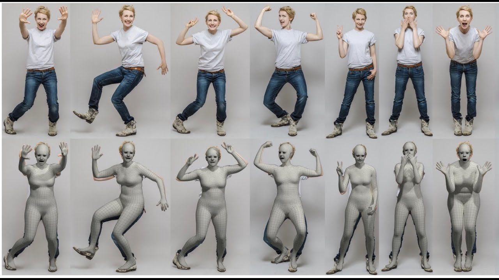

[About](#about) - [MoCap SMPL-X priors](#motion-capture-using-smpl-x-priors) - [NeRF Rendering System](#neural-radiance-field-rendering-systems) - [Problems](#problems-working-on) - [References](#references) 

##### About
With more and more AR and VR devices becoming ubiquitous and advancement in animation the animation, the difference between virtual and reality are getting blurred. This makes perception of reality and rendering it along with virtual scenes as the core problems. Being interested application of AI/ML in the area of 3D graphics and animation and having a background in video encoding for conferencing, transmission am working on two problems (a) Motion Capture from monocular videos dealing in perception and (b) Neural rendering of rigid and non-rigid bodies dealing in rendering. 

Further, the current advancements in deep learning in the area of GAN, Implicit representations, Transformers, GCN make them a invaluble tool that aid in solving these core problems. Anyone interested in the following problems can reach me nitthilan@gmail.com

###### Motion Capture using SMPL-X priors [(details)](#problems-working-on)
- Using monocular video information

- Facial, finger and full Body pose extraction

<!--  -->

######  Neural radiance field rendering systems [(details)](#problems-working-on)
- Fast training for rigid bodies

- Non-rigid (human models) pose, cloth and hair feature transfer
 

##### Problems Working On
- Shape and pose iteration for refinement of image based pose for the original dimension [link](https://github.com/nitthilan/video_pose_estimation)
	- HMR (Human mesh recovery) use CNNs and so the images are resized thus losing its prediction precision. 
	- SMPLify-X based approches are iterative and do not reach global minima faster
	- A hybrid approach which merges the both to get higher precision prediction while maintaining consistency across frames
- Multiresolution video pose estimation
	- A video has a large number of images and estimating pose for all frames would be huge
	- Pose interpolation using transformers to reduce computation
	- Transformer based approaches to use temporal consistency to get better prediction for occluded parts
	- Identify non occluded frames and interpolate intermediate frames to estimate pose
- Learning pose using videos in the wild 
	- Use 2D keypoint markers and temporal shape consistency to learn mocap information
	- Estimate facial and finger pose estimation
	- Estimate initial prediction using resized input images using neural network based approaches
	- Apply SMPLify-X based iterative approaches to refine pose using full resolution images to get precise prediction
- Facial, hand and full pose control of deformable human neural avatars
	- Extract mocap information from driver video
	- Learn neural body based avatars using SMPL-X
	- Deform SMPL-X model using the driver video
- Deformable neural cloth and hair styles extraction from video in wild
	- Use human parser to extract different clothing types and hair
	- Learn neural models for each segment extracted earlier
	- This helps in transfering information across different avatars
- Multi-resolution neural training for both rigid and non-rigid objects
	- Active learing based appraches to identify subset of images which maximize learning
	- Start with low resolution images and downsampled video
	- Choose the training subset based on the rendered quality across different view
- Voxel based latent learning [link](https://github.com/nitthilan/kilonerf_modified)
	- Learn a pre-trained network which approximates simpler shapes ata voxel level
	- Reduce training iteration time
- Neural sub-problems
	- Predicting occluded regions from known regions
	- GAN based generator for neural body

##### References:
- [VIBE: Video Inference for Human Body Pose and Shape Estimation](https://github.com/mkocabas/VIBE)
- [SMPLify-X](https://github.com/vchoutas/smplify-x), [SMPL-X](https://smpl-x.is.tue.mpg.de/), [SMPL](https://smpl.is.tue.mpg.de/)
- [FrankMocap: A Strong and Easy-to-use Single View 3D Hand+Body Pose Estimator](https://github.com/facebookresearch/frankmocap)
- [End-to-end Recovery of Human Shape and Pose](https://github.com/akanazawa/hmr), [SPIN: SMPL oPtimization IN the loop](https://github.com/nkolot/SPIN)
- [Illustrated Transformer](https://jalammar.github.io/illustrated-transformer/)
- [NeRF: Neural Radiance Fields](https://github.com/bmild/nerf)
- [Neural Body: Implicit Neural Representations with Structured Latent Codes for Novel View Synthesis of Dynamic Humans](https://github.com/zju3dv/neuralbody)
- [KiloNeRF: Speeding up Neural Radiance Fields with Thousands of Tiny MLP](https://github.com/creiser/kilonerf)
- [Neural Sparse Voxel Fields (NSVF)](https://github.com/facebookresearch/NSVF)
- [Controllable Person Image Synthesis with Attribute-Decomposed GAN](https://github.com/menyifang/ADGAN)
- [PIFuHD: Multi-Level Pixel-Aligned Implicit Function for High-Resolution 3D Human Digitization (CVPR 2020)](https://github.com/facebookresearch/pifuhd)

