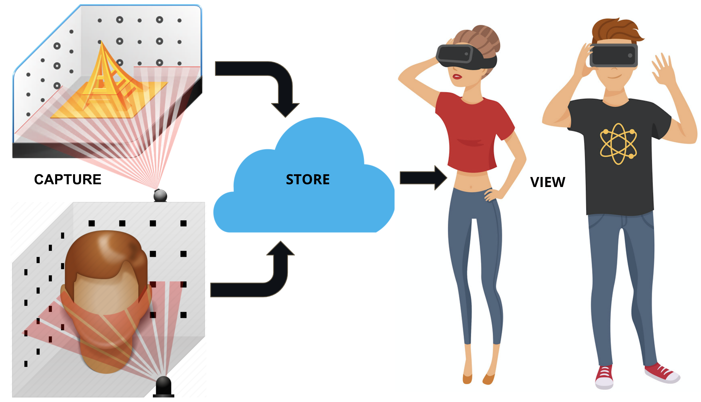
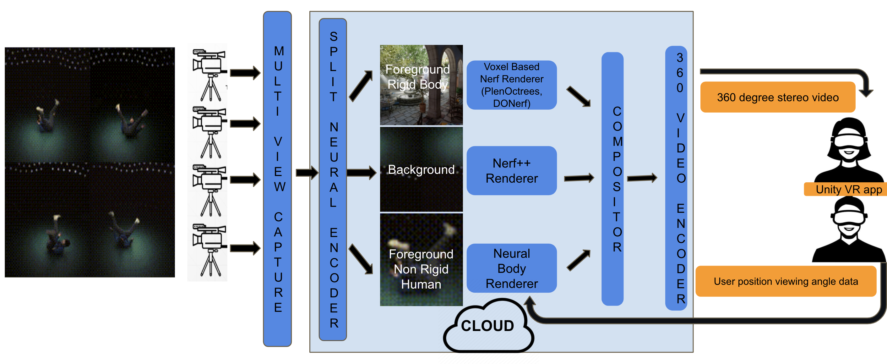
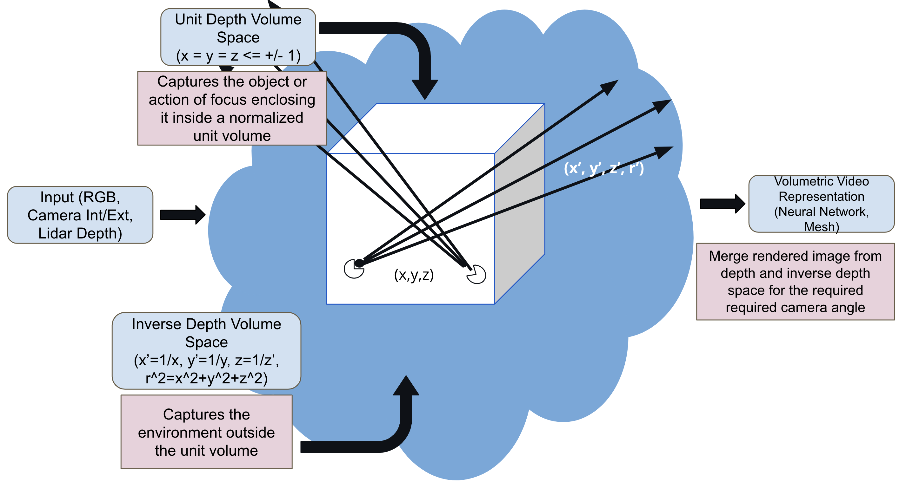
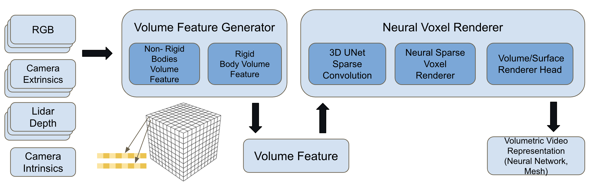

[[ABOUT]](#about) - [[OVERVIEW]](#overview) - [[ARCHITECTURE]](#Deep-Neural-Radiance-Field-based-3D-Volumetric-Video-Capture-Rendering-and-Streaming) - [[NEURAL RENDERING PIPELINE]](#neural-encoder-architecture-and-pipeline)- [[PROGRESS]](#progress) - [[REFERENCES]](#references) - [[CODE (under dev)]](https://github.com/nitthilan/volumetric_video) - [[OTHER PROBLEMS]](/other_problems/)

# About

Videos and photos are used to capture our happy and memorable moments we shared with our friends and family. It takes us back to the place and time when the event happened, helping us reminiscence the moment. Instead, how would it be if we could capture these fleeting moments in 3D? Store and share them with your friends and family like you share photos and videos? Invite them to that moment so that we all could relive it? We are building a system to recreate an immersive experience to bring your memories to life in VR. Wanna ride along mail me @ nitthilan@gmail.com

    

        <video src="https://user-images.githubusercontent.com/4926564/140678640-dd953bc5-185f-4f3a-8a56-6ce225625334.mov" autoplay loop controls="controls" style="width: 500px;"> </video> 
    

    

        <video src="https://user-images.githubusercontent.com/4926564/140678863-6f5c790f-f705-44fa-a1e0-47f311ddbe13.mp4" controls="controls" style="width: 500px;" autoplay loop>
		</video>
    

# Overview

To give a overview of our solution, a user scans the 3D environment he wants to store, as a video capturing it from different viewing angles. He can use multiple cameras to capture more information about the environment like actions. We use artificial intelligence to reconstruct and encode the 3D environment using the different videos captured by the user. Unlike other methods which use laser or depth sensors to estimate point clouds, we just use the scanned RGB monocular videos to reconstruct the environment. Finally, this captured 3D environment is viewed using a VR headset in a 360-degree stereoscopic panorama. A stereoscopic photo is a pair of images, taken simultaneously with two lenses placed like our eyes, about 65 mm apart and looking in the same direction. When presented to the two eyes by a stereoscope, these images give most people the impression of seeing a 3D space. A stereoscopic panorama is a pair of 360-degree images, which when viewed with synchronized pano viewers (like a VR headset) presents a stereo pair. Further, as the user moves around in the environment, we generate the corresponding stereo pair based on the user position to give the user an immersive 3D experience. 

## Deep Neural Radiance Field-based 3D Volumetric Video Capture, Rendering, and Streaming

Let's deep dive into the details of our solution. To provide a user with an immersive experience, the whole media pipeline from capture, storage, rendering, and streaming should be capable of handling 3D volumetric video data. Volumetric video capture technology is a technique that digitizes a three-dimensional space (i.e., the volume of space), object, or environment. The captured object can be digitized and transferred to the web, mobile, or virtual worlds and viewed in 3D. It does not have a set viewpoint, so the end-user can watch and interact with it from all angles, enhancing their experience and heightening their sense of immersion and engagement. The difference between 360-degree video and volumetric video is the depth provided with volume. In a 360-degree video, users can only view the action from a single, constant depth. With volumetric video, the end-user can play director and control how far in or out they want to explore the scene.

First, to capture 3D volumetric data, we would require a multi-camera system, which captures the action from different views. After capturing the data as a set of videos we process the videos such that we break down the scene into a less important background region, a center stage foreground area where the actual action happens. This helps in encoding the background with less detail and the foreground with higher precision. Further, to enhance the quality, we separate the objects in the foreground region into rigid and non-rigid human bodies. In effect, we split the scene into three prominent regions (a) Foreground Rigid Bodies (b) Foreground Non-Rigid (Human) Bodies (c) Background Region. We process them separately as three different pipelines. Unlike, other solutions which encode objects as meshes and textures, we encode each region using a deep neural radiance field-based solution. Next, to provide an immersive visualization, the three regions are rendered separately into a stereo 360-degree panoramic image for each time instant and stream it to a Unity VR app running on a VR headset. Thus we breakdown our system into the following components:

### (a) Multi-view capture system

We design a capture system that ranges from 1 to N monocular RGB cameras. This could be as simple as one or more mobile cameras capturing a performance or scene from different angles. Since our setup is simple it enables anyone to create content that could be immersively consumed. The capture is timestamped so that multiple captures can be correlated for a particular time instance across different cameras. These different video streams are then uploaded to a cloud server.

### (b) Split neural encoder, renderer and compositor

The next stage involves splitting the data into foreground and background, rigid and non-rigid (human) bodies. Each of these components is then encoded separately into a deep neural network. Background region is encoded using Nerf++ based network. The foreground requires optimized rendering (or inference) and many solution options are to be investigated. Some of the options are KiloNerf, PlenOctrees. Finally, the non-rigid body is encoded using Neural body-based network solutions. The scene is composited by rendering the individual neural networks encoded for the three separate regions based on the position and viewing angle feedback from the user. This composited stereo 360-degree panorama image is then passed on to the next stage to be compressed and streamed

### (c) 360 Stereo video encoder 

The final stage, encodes the composited stereo image and compresses it into a video stream (H264, MPEG, MJPEG) and streamed to the VR headset. A Unity-based VR app displays the compressed stream on the skybox shader to provide an immersive visualization of the captured sequence to the end-user

# Progress

## Stage 2

- Check the detailed architecture for the current implementation
- Dataloader and feature extractor module based on depth - 1 day - Done
- Data generation using iPhone/iPad Pro - 0.5 day - Done
- Inverse depth space nerf++ renderer - 1 day
- Training loop for non-rigid neural renderer - 2 days - Done
	- 3D sparse convolution
	- raycasting based rendering using volumetric prediction head
	- Dataloader and cost function implementation

- Testing and Debugging (Completion of basic pipeline) - 2 days
- Experiment with surface prediction head - 2 day
- Non-rigid volume renderer - 3 days
	- Pose estimation using LiDAR
	- Volume feature generator using ray triangle intersection
	- Testing and Debugging
- Unity VR application using hand gestures and locomotion - 3 days

## Stage 1

- Individual modules are available for each module
- Implemented a end to end pipeline from capturing a video to rendering it and visualizing the output using a VR headset
- Baseline modules used: 
	- Colmap: To learn camera parameters
	- Nerf++: Encoding unbound scenes using an inverted sphere parameterization
	- Unity Oculus VR App: Rendering Stereo 360 degree panoroma images at different camera positions
- Learnings:
	- Colmap takes exponentially more time to identify camera parameters when the number of images to be registered are large. The mapper module spends 17 minutes for 200 odd images and this increases to 1-2 hours with 500 images and larger dimension
	- Training time for Nerf++ - Takes 18-24 hours on a 4 GPU system
	- Slow inference times - 14 seconds per 4000x4000 dimension image (top bottom stereo)
- Using 360 degree panoroma stereo may not work. So initially try just planar stereo like the demo videos
- End to end pipeline with best qualities picked from different NeRF/MVS implementation
- Reduce the time across the whole pipeline. Major bottlenecks:
	- Colmap based structure from motion (SfM) estimation
	- Overfitting the NeRF module with excessive input views
	- Depth estimation for feature mapping and dense voxel processing over the whole volume
- The whole pipeline is implemented in Neural radiance field based solution

## Stage 0

- The encoding (or storage) is time-consuming since it depends on the training time which is at present in the order of hours
- The streaming delay would still be significant since it is done through the cloud

# Neural Encoder [Architecture and Pipeline]
In this section we explain the proposed neural encoder architecture where we try to take the best aspects of the various proposed solutions in literature and combine them together into a pipeline which address the pitfalls in their individual solutions. The architecture is generic, addressing both rigid and non-rigid body captures in a unbounded environment. Further, it tries to simplify the capture mechanism by a single iPhone video with Lidar depth information. The major pitfalls with the earlier proposed solutions used in Stage 1 was the long training time it takes for representing the 3D volumetric data using neural networks. This long training time was due to (a) estimation of camera intrinsic and extrinsic camera parameters using Structure from Motion approach used in Colmap. We utilize the IMU data availble on iPhones to estimate this (b) estimating the depth information of surfaces for mapping voxel features. We utilize the Lidar depth information to generate a feature point cloud which we can map to a particular voxel (c) overfitting of NeRF based variants using excessing input images to approximate the 3D volume. We utilize the ResNet convolution features extracted from the image to bootstrap the neural rendering process, thus inturn reducing the training time. Further, we use baysian optimization techniques to choose appropriate subset input images to reduce the training time.

## Overview
The neural encoder takes as input a series of images captured from different angles, their corresponding camera parameters (intrinsic and extrinsic), the lidar depth information. The pipleine splits the world 3D region into two different spaces (a) Unit depth volume space (b) Inverse depth volume space. The region of interest defined by where the action happens is normalized to lie within a unit cube. This region is called the Unit volume space. Using a unit cube instead of a sphere helps in spliting the region into voxels thereby helping in speeding up inference times of the neural rendering pipeline. We use a voxel based neural encoding approach to learn the 3D volume/surface. The region outside the normalized unit cube is mapped to a inverse depth volume, and we use a single NeRF MLP to encode this region. Finally, when a user request a output image from a new camera position, we render the values from both the regions and combine them together to display it to the user.

## Pipeline

### Inverse Depth Volume Space

In the inverse depth space, as proposed by NeRF++, we convert every 3D point to their inverses and parameterize the NeRF MLP with (x', y', z' and r') as shown in the figure. This maps all the values from 1 to infinity to values within 1 to 0.

### Depth Volume Space

Depth volume space is more complex, since we capture both rigid and non-rigid (human actions) sequences using this pipeline. We split it into two stages (a) Volume Feature Generator (b) Neural Voxel Renderer. 

## Volume Feature Generator
The volume feature generator module takes images captured in multiple camera directions, passes it through a ResNet based convolution feature generator and then using the Lidar depth information maps it to a voxel inside the unit cube. The features mapped from different images to a same voxel are then averaged to estimate the voxel feature. 

### Rigid body volume feature [Depth Voxel Feature Mapper]
For rigid bodies we do not do anything special since it does not have any deformations. 

### Non-Rigid body volume feature [SmplX Feature Mapper]
However, in case of non-rigid bodies, based on the motion, the 3D geometry is defomrmed and also gets mapped to different regions of the 3D voxel due to the changes in pose. We adapt the ideas from the Neural body paper, where we first estimate the 3D pose from images for the SMPL mesh. Then map the convolution features to the SMPL vertices which is then mapped to the corresponding voxel. 
 

## Neural Voxel Renderer
The feature volume generated from the previous stage is taken as input for the Neural Voxel Renderer. The voxel features is passed through a sparse 3D UNet architecture to spread the features along the surface of the 3D objects in scene. These features are used as input for the ray casting module which uses a MLP as its head. Based on what the MLP predicts we can differentiate the kind of renderer we plan to learn.

### Volumetric Prediction Head
If the MLP head just predicts the transmittance and RGB values alone then it acts as a volumetric prediction head.

### Surface Prediction Head
However if it predicts surface normals along with the transmittance and RGB, then it tries to approximate the smooth surface prior there by acting as a Surface prediction head.

<!-- #### BO for training -->

## Future Problems
This section talks about possible future problems which need to be addressed if we do not have that data available. If camera paramters cannot be estimated using the phone logs then how do we go about estimating them and the issue associated with them. Simillarly, if the depth information available from Lidar is not available how would the complexity of the pipeline change?

### Non-rigid body neural rendering:
Extract 2D features and map it to SMPLX. We can adapt this to other non-rigid bodies like animals since they too have a mesh prior - like SMPL there is a mesh for babies and animals. Facebook has such a representation. We can add clothing related mesh prior assuming cloths of a particular form like free flowing etc and then apply this idea [There is a clothing prior https://qianlim.github.io/SCALE, https://cape.is.tue.mpg.de/]. Also, for using a single video - first register the person in their A pose or TPose and then use this info to map the person when he moves

### Camera Paramter Estimation:
Current estimation methods using Colmap is time consuming. It exponentially increases with the number of input images for estimation. In particular the 

### Splitting Voxel Grid:
What are the different ways a voxel grid can be created. Can r, theta, phi representation instead of voxels? Like Nerf++, for nearby regions split it into voxels in the range 0-1 and for further parts make it from 1-inf . The splitting mechanism can be num parts 10 => 1000 voxels, [1/r, 1/r^2, 1/r^3], [10, 100, 1000]/r. Also can Octree be tried in the 1/r region?

### Bayesian Optimization:
Calculate inference from different camera views and choose the right set of images to learn [Bayesian optimization for choosing the right set of subset images]. We use bayesian optimization to find areas which need more learning. The camera position (x,y,z, axis angle representation) is the input (at a higher levels regions withing the camera could also be used). The error values between predicted and the actual obtained during training could be used?. Sampling random areas within a image or using a downsampled image size to estimate the over all error based on the inference budget? Inference is costly and so you cannot evaluate all the positions. As the training progresses the old values become better and so has to be reevaluated? Can this be demonstrated with just nerf and assuming a infinite budget and training using images based on inference feedback evaluated at all positions ? Then if we make inference faster this can improve?

### Nerf Heads:

#### PlenOctree
512x512 - NerfSH(PlenOctree) - Octree representation. Finally a single value for every tree node. Since we learn Spherical harmoics at each voxel, we just need to use triliniear interpolation to render the value in that position based on ray direction?

#### Baking NeRF[Sparse Neural Radiance Grid (SNrG)]
Grid of N^3 and data stored as MB of size B^3 for efficient access. Each voxel stores opacity, diffuse color (Cd), specular features (Vs)
The evaluation for direction based effects is done by a single neural network evaluation which sums the features along the ray and produces a color
Understand Specualr Features in SNrG, Spherical harmonics and Spherical gaussians in PlenOctree??

#### NexMex 
Uses a set of planes - plane sweep which tries to model the transparency and the Shperical harmonics values k0, k1, kN. 
Mixed Implicit and explicit representation i.e. though they use a neural network to predict the k0, k1 etc and the alpha values they calculate it at fixed depths and store them in a array instead of directly using the neural network values. Further, they use the neural network for regularizing the k0, k1 and alpha values so that they do not overfit the data. 

The good thing from here is they try to learn their own radial basis funtion instead of standard basis like fourier or SH or Spherical gaussian. 

#### MVSNerf:
Uses neighboring images to extract convolutional features i.e. if we have to generate view for a particular camera position, it identifies three (M) nearby images homomorphically projects them all to the reference camera position and creates a Cost Volume. All the processing is from the reference point of view (No global view of the object). Then it uses the color information appended from the neighboring views to regress 

### Mechanisms for faster inference:
- FastNerf: Caching techniques i.e. precalculating partial outputs for required directions and using that to optimze the rendering 
- Decoupling view dependent and view-independent parts of the network and precomputing the view dependent parts earlier and doing only the view dependent part
- Use SiREN for faster convergence

### Non-visible voxels identification:
We render alpha maps for all the training views using this voxel grid, keeping track of the maximum ray weight 1 − exp(−σiδi) at each voxel. Compared to naively thresholding by σ at each point, this method eliminates non-visible voxels.

Module which evaluates the whole scene voxel by voxel and identifies voxels which have not been scene by the camera captured images
this gives feedback on angles to take camera captures from
can GANs or interpolation try filling these areas [Gan or Superresolution approaches for predicting intermediate unknown regions]

## Reference
- [NeRF: Neural Radiance Fields](https://github.com/bmild/nerf)
- [Neural Body: Implicit Neural Representations with Structured Latent Codes for Novel View Synthesis of Dynamic Humans](https://github.com/zju3dv/neuralbody)
- [Neural Sparse Voxel Fields (NSVF)](https://github.com/facebookresearch/NSVF)
- [NeRF++: Analyzing and Improving Neural Radiance Fields](https://github.com/Kai-46/nerfplusplus)

- [KiloNeRF: Speeding up Neural Radiance Fields with Thousands of Tiny MLPs](https://github.com/creiser/kilonerf)
- [MVSNeRF](https://arxiv.org/pdf/2103.15595.pdf)
- [NeX: Real-time View Synthesis with Neural Basis Expansion](https://arxiv.org/pdf/2103.05606.pdf)
- [Baking Neural Radiance Fields for Real-Time View Synthesis](https://arxiv.org/pdf/2103.14645.pdf)
- [FastNerf](https://arxiv.org/pdf/2103.10380.pdf)
- [PlenOctrees: For Real-time Rendering of Neural Radiance Fields](https://alexyu.net/plenoctrees/)

<!-- Unifying surface rendering with volume rendering: -->
- [UNISURF: Unifying Neural Implicit Surfaces and Radiance Fields for Multi-View Reconstruction](https://moechsle.github.io/unisurf/)
- [Multiview Neural Surface Reconstruction by Disentangling Geometry and Appearance, Universal Differentiable Renderer for Implicit Neural Representations, UDR](https://arxiv.org/pdf/2003.09852.pdf)
- [Multi-view 3D reconstruction using neural rendering. Unofficial implementation of UNISURF, VolSDF, NeuS and more.](https://pythonrepo.com/repo/ventusff-neurecon-python-imagery)

- [StrayVisualizer](https://github.com/kekeblom/StrayVisualizer)
- [open3d tutorial](http://www.open3d.org/docs/release/tutorial/pipelines/index.html)
- [StrayScanner Data capture](https://apps.apple.com/ci/app/stray-scanner/id1557051662?l=en)
- [iPhone 12 Pro Lidar Sensitivity](https://www.it-jim.com/blog/iphones-12-pro-lidar-how-to-get-and-interpret-data/)

- [IBRNet: Learning Multi-View Image-Based Rendering](https://arxiv.org/pdf/2102.13090.pdf) -  - Read about this
- [MVSNeRF: Fast Generalizable Radiance Field Reconstruction from Multi-View Stereo](https://arxiv.org/pdf/2103.15595.pdf)[this has result about all the implementation](https://github.com/apchenstu/mvsnerf/blob/main/renderer.ipynb)

- [VIBE: Video Inference for Human Body Pose and Shape Estimation](https://github.com/mkocabas/VIBE)
- [SMPLify-X](https://github.com/vchoutas/smplify-x), [SMPL-X](https://smpl-x.is.tue.mpg.de/), [SMPL](https://smpl.is.tue.mpg.de/)
- [FrankMocap: A Strong and Easy-to-use Single View 3D Hand+Body Pose Estimator](https://github.com/facebookresearch/frankmocap)
- [End-to-end Recovery of Human Shape and Pose](https://github.com/akanazawa/hmr), [SPIN: SMPL oPtimization IN the loop](https://github.com/nkolot/SPIN)
- [Illustrated Transformer](https://jalammar.github.io/illustrated-transformer/)
- [Controllable Person Image Synthesis with Attribute-Decomposed GAN](https://github.com/menyifang/ADGAN)
- [PIFuHD: Multi-Level Pixel-Aligned Implicit Function for High-Resolution 3D Human Digitization (CVPR 2020)](https://github.com/facebookresearch/pifuhd)
- [Debugging networks](https://jonathan-hui.medium.com/debug-a-deep-learning-network-part-5-1123c20f960d)
-  [On the Continuity of Rotation Representations in Neural Networks](https://arxiv.org/pdf/1812.07035.pdf), [Tutorial blog](https://towardsdatascience.com/better-rotation-representations-for-accurate-pose-estimation-e890a7e1317f)

<!-- Colmap, Camera parameter estimation -->
- [Self calibraring neural radiance fields](https://github.com/POSTECH-CVLab/SCNeRF)
- [Unofficial & improved implementation of NeRF--: Neural Radiance Fields Without Known Camera Parameters](https://pythonrepo.com/repo/ventusff-improved-nerfmm)
- [NeRF−−: Neural Radiance Fields Without Known Camera Parameters](https://arxiv.org/pdf/2102.07064.pdf)
- [BARF](https://chenhsuanlin.bitbucket.io/bundle-adjusting-NeRF/)
[Pixel-Perfect Structure-from-Motion with Featuremetric Refinement](https://psarlin.com/pixsfm/), [Back to the Feature](https://github.com/cvg/pixloc)

<!-- https://www.360cities.net/help/stereo_panos

https://www.modtechlabs.com/volumetric-video-introduction/

- Explain the application in simple terms like what is the input, what is the output
- Explain terms like volumetric video, Neural radiance field etc
- An app where you can capture your environment and share it with your friends
- Then jump into the enviroment and play games like hide and seek or find the clue based on clues - treasure hunt, or pin ball, shoot arrows, throw balls etc
- Like sharing photos and videos now you can share your whole environment

More and more AR and VR devices becoming ubiquitous and advancement in animation, we see a shift in the way people consume content. Instead of using mobile, tablet and TV screens, more and more immersive 3D volumetric displays using AR/VR devices like Oculus, Holo Lens, Vive are getting used. This inturn increases the demand for generation and consumption of immersive content for various applications like live action sports, music concerts, performances or virtual worlds where consumers can interact and hang out with their favorites artists, sportsman or teleport themselves to exotic locations

Being interested in application of AI/ML in the area of 3D graphics and animation and having a background in video encoding for conferencing, transmission and storage am proposing a low cost consumer grade volumetric video capture, storage, renderer and streaming solution for AR/VR end devices

 -->